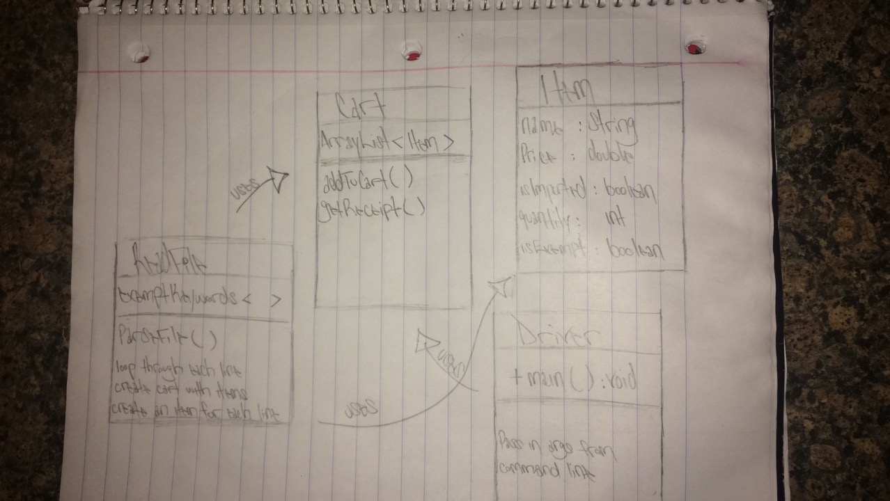

### Sales Taxes

Basic sales tax is applicable at a rate of 10% on all goods, except books, food, and medical products that are exempt. Import duty is an additional sales tax applicable on all imported goods at a rate of 5%, with no exemptions.

When I purchase items I receive a receipt which lists the name of all the items and their price (including tax), finishing with the total cost of the items, and the total amounts of sales taxes paid.  The rounding rules for sales tax are that for a tax rate of n%, a shelf price of p contains (np/100 rounded up to the nearest 0.05) amount of sales tax.

Write an application that prints out the receipt details for these shopping baskets...

#### Input
```
Input 1:
1 book at 12.49  
1 music CD at 14.99  
1 chocolate bar at 0.85  

Input 2:
1 imported box of chocolates at 10.00  
1 imported bottle of perfume at 47.50  

Input 3:
1 imported bottle of perfume at 27.99  
1 bottle of perfume at 18.99  
1 packet of headache pills at 9.75  
1 box of imported chocolates at 11.25  
```

#### OUTPUT  
```
Output 1:  
1 book : 12.49  
1 music CD: 16.49  
1 chocolate bar: 0.85  
Sales Taxes: 1.50  
Total: 29.83  

Output 2:  
1 imported box of chocolates: 10.50  
1 imported bottle of perfume: 54.65  
Sales Taxes: 7.65  
Total: 65.15  

Output 3:  
1 imported bottle of perfume: 32.19
1 bottle of perfume: 20.89  
1 packet of headache pills: 9.75  
1 imported box of chocolates: 11.85  
Sales Taxes: 6.70  
Total: 74.68  
```

#### Running the program
```bash
$ cd SalesTax/src
$ javac Driver.java
$ java Driver "../Input/input1.txt" "../Input/input2.txt" "../Input/input3.txt"
```
*The name of the file has to be surrounded by quotes in order for the program to run. If you're passing in multiple files, be sure to separate each file name with a space*

#### Assumptions
My biggest assumption was that there must be a way to parse a file. I assumed that once the file was parsed, I could separate the data and start working on individual pieces contained in the files.

#### Design
I started out wanting to use the Command Pattern, because it is the design pattern that I am most familiar with. However, I came to the realization that I did not have enough experience working with Java in order to implement it.

Here's a flowchart I drew when I first started:

